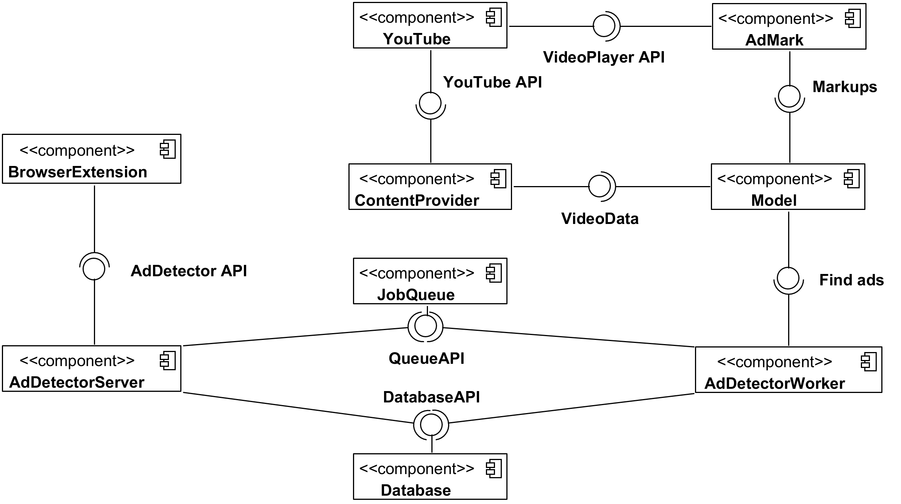

# YouTubeAdvertisementDetector
Detector of blogger advertisements in YouTube videos
 
**Goal of project**: to develop Web browser extension to detect and automatically skip advertisements in YouTube videos which where inserted by blogger at video editing stage.

**Components:**
1. *AdMark* - web application to markup advertisements in videos to collect training data.
2. *AdDetectorModel* - consists of main logic for detecting ads.
3. *AdDetectorChromeExtension* - browser extension for Google Chrome that requests location of ads from server by video identifier and automatically skips these parts of video.
4. *AdDetectorServer* - REST server that responds to queries from browser extension and translate queries to workers via message queue.
5. *AdDetectorWorker* - handler of queries, it gets queries from server via message queue, uses model to detect ads and saves results to database.

